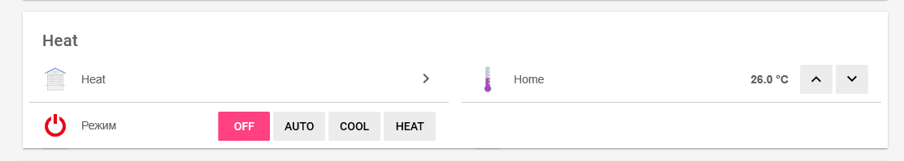

#ESPHome config to control Midea conditioner

Features
- Support AUTO, HEAT, COOL modes
- Support set temperature
- Set mode and temperature available by MQTT

## Hardware
This config use my own [ESP32 board](http://www.maxx.net.ua/?p=484) with ethernet support.  My board fully compatible with [wESP32 board](https://wesp32.com/). You can use schematic from these board or change config to use WiFi.

## Software

1. Prepare environment for [ESPHome](https://esphome.io/)
2. Run `esphome heatpumpcontroller.yaml run`
3. Use

## OpenHAB config

This config can be controlled via OpenHAB with MQTT

1. Create items
```` 
Group  HEAT "Heat"
Number H_TEMP "Температура [%.1f С]" <temperature> (HEAT) { mqtt=">[broker:heatpumpcontroller/climate/my_custom_climate/target_temperature/command:command:*:default]" }
String H_MODE "Режим" (HEAT) { mqtt=">[broker:heatpumpcontroller/climate/my_custom_climate/mode/command:command:*:default]" }
````
2. Create config for sitemap
````
Frame label="Heat" {
                Group item=HEAT
                Setpoint item=H_TEMP label="Home [%.1f °C]" minValue=18 maxValue=30 step=1.0
                Switch item=H_MODE mappings=[OFF="OFF", AUTO="AUTO", COOL="COOL", HEAT="HEAT"]
        }
````

Result should be like:


